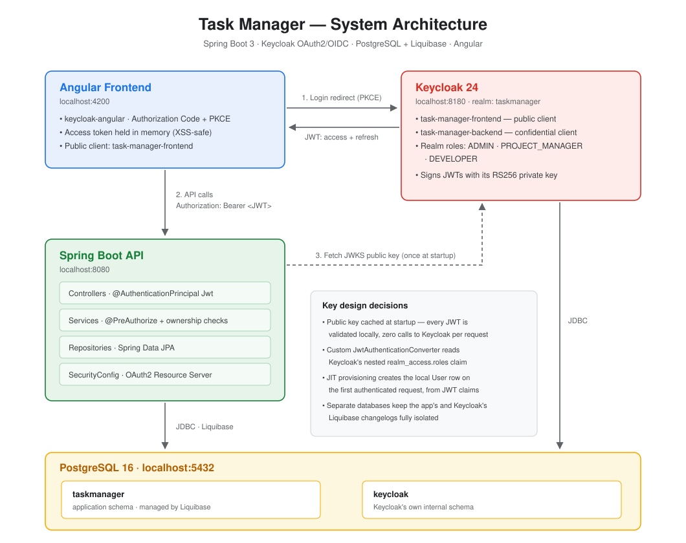

# Task Manager

A full-stack task management application (Jira-lite) built with **Spring Boot 3**,
**Keycloak OAuth2/OIDC**, **PostgreSQL**, and **Angular** — with role-based and
resource-based authorization.

> Status: backend complete and verified end-to-end with real Keycloak tokens.
> Angular frontend in progress.

## What this demonstrates

- OAuth2/OIDC authentication with Keycloak — realms, clients, and JWT validation
- Role-based access control (`@PreAuthorize`) and resource-based ownership checks
- Just-in-time user provisioning from JWT claims
- JPA relationships with proper cascading, lazy loading, and optimistic locking
- Liquibase-managed schema migrations, isolated from Keycloak's own database
- Full-stack ownership: backend, auth, database, and frontend (Angular)

## Architecture



Angular authenticates directly against Keycloak (Authorization Code Flow + PKCE)
and never sees user credentials. Spring Boot validates JWTs locally using
Keycloak's cached public key — no network call to Keycloak on every request.

## Roles

| Role | Permissions |
|---|---|
| `ADMIN` | Full access to all projects and tasks |
| `PROJECT_MANAGER` | Create projects, create and assign tasks |
| `DEVELOPER` | View assigned work, update status of their own tasks |

## Tech stack

| Area | Technology |
|---|---|
| Backend | Java 17, Spring Boot 3.4, Spring Security (OAuth2 Resource Server) |
| Auth | Keycloak 24 (OIDC, JWT, realm-based roles) |
| Database | PostgreSQL 16, Liquibase (versioned migrations) |
| Frontend | Angular (in progress) |
| Build / Infra | Maven, Docker Compose |

## Running locally

```bash
# 1. Start Postgres and Keycloak (realm auto-imported)
docker compose up -d

# 2. Run the backend
./mvnw spring-boot:run

# 3. Access Keycloak Admin Console
open http://localhost:8180   # admin / admin
```

The realm, clients, and roles are pre-configured via
`keycloak/taskmanager-realm.json`, imported automatically on first startup.

## API endpoints

### Create a project (`PROJECT_MANAGER` or `ADMIN`)
```bash
curl -X POST http://localhost:8080/api/projects \
  -H "Authorization: Bearer $TOKEN" \
  -H "Content-Type: application/json" \
  -d '{"name": "Website Redesign", "description": "..."}'
```

### List my projects
```bash
curl http://localhost:8080/api/projects -H "Authorization: Bearer $TOKEN"
```

### Create a task (`PROJECT_MANAGER` or `ADMIN`)
```bash
curl -X POST http://localhost:8080/api/tasks \
  -H "Authorization: Bearer $TOKEN" \
  -H "Content-Type: application/json" \
  -d '{"title": "Design homepage", "priority": "HIGH", "projectId": "..."}'
```

### List tasks by project
```bash
curl "http://localhost:8080/api/tasks?projectId=..." -H "Authorization: Bearer $TOKEN"
```

### List my assigned tasks
```bash
curl http://localhost:8080/api/tasks/my -H "Authorization: Bearer $TOKEN"
```

### Update task status (`PROJECT_MANAGER`/`ADMIN`, or the assigned `DEVELOPER`)
```bash
curl -X PATCH http://localhost:8080/api/tasks/{id}/status \
  -H "Authorization: Bearer $TOKEN" \
  -H "Content-Type: application/json" \
  -d '"IN_PROGRESS"'
```

## Roadmap

- [x] Docker Compose: Postgres (multi-database) + Keycloak with realm import
- [x] Entities, Liquibase migrations, repositories
- [x] Spring Security JWT validation with custom Keycloak role converter
- [x] Just-in-time user provisioning
- [x] Role-based authorization (`@PreAuthorize`)
- [x] Resource-based authorization (task ownership checks)
- [ ] Delete/update endpoints for projects and tasks
- [ ] Angular frontend with Keycloak-Angular integration
- [ ] Integration tests with Testcontainers
- [ ] GitHub Actions CI

## Why this project

Built to prove full-stack ownership with a real, non-trivial auth integration —
Keycloak realm configuration, JWT validation, role-based and resource-based
authorization — going beyond typical CRUD-only portfolio projects.
